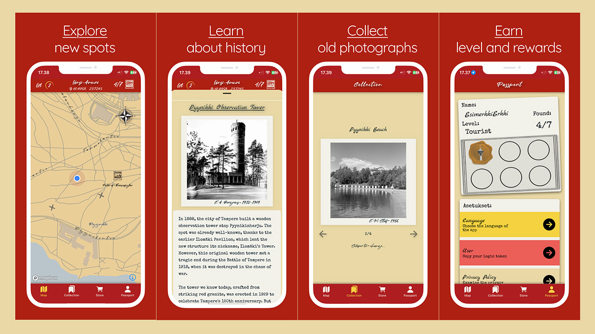

# Memories From Tampere 

## Description

### What is it?

A cross-platform multilingual mobile app about exploring the history of Tampere through old photographs and stories.
### Who is it for?

The app is made for residents of Tampere as well as tourists of the region.
### Why?

The purpose of the app is to provide a platform for people to learn about history in a more engaging way and promote lesser known/forgotten history of the region as well. As a developer, I have three clear goals for the app:
- Act as a portfolio project showcasing my work to recruiters
- Qualify to be used as a 10 credits course project for [Full Stack Open](https://fullstackopen.com/)
- Get my own app released on the App Store and Google Play

**[DEMO VIDEO OF THE APP](https://vimeo.com/1044428510)**

### Learning objectives

* Design and implement a UI without relying heavily on any component library.
* Learn to use React Native and to create native builds using Xcode and Android Studio.
* Create a project with actual use cases and potential for a public release.
* Get feedback from real users.

### Structure

This repository is the public front for the project. The two repos containing the actual code are submodules of this repo. These repositories are private, and I will need to add everyone interested as a contributor to grant access to the repos. I would have liked to share the code through a link that grants access in my CV, but unfortunately there is no easy way to do this in GitHub. I plan to release the app in app stores this spring, which is why the repos are private. They also contain some **public** API keys which are, in theory, safe to expose, but I like to keep it like this for peace of mind.
#### How to gain access?
> To gain access, send me the email address associated with your GitHub account.
> You can do this via email, for example. My email address is max.perala@hotmail.fi.

## Features

* Fully functional and interactive custom map with custom made markers.
* Real-time location
* Cross-platform (Android/iOS)
* Multilingual (English/Finnish)
* Custom-design components
* Password-free user management for ease of use
* Gamified elements to increase user engagement, like collecting stamps and a simple level system.
* Modular design to scale to different cities by only changing thematic elements like colors, fonts and icons and researching new content.
* Custom icons and other elements made using Photoshop and Illustrator, [Ionicons](https://github.com/ionic-team/ionicons) are also used for some UI elements.

## Testing the app

The easiest way to test the app in its current development stage is to simply **download the latest .APK release** from this repository, and run it in an Android simulator or on a real device. It works using a backend I have deployed for testing purposes.

**Note that the app requires for you to physically be in Tampere and visit locations on the map, so if you are located in a different city or don't wish to walk you will have to simulate your location somehow!**

The location simulator in the Android studio emulator is easy to use and works well. You can also set a mock-location app in the settings of a physical device if you have developer mode enabled.

> I recommend using Android API version 35 on the emulator, as this is the one used for development. If you were to build the iOS version I recommend iOS 17 and a physical device,
> since expo-location does not currently pair well with the Xcode simulator.

You can also build the app yourself for either Android or iOS using native tools or EAS, if you have requested access to the actual frontend repository contained as a submodule in this repo.

**The app is not compatible with Expo Go due to extensive use of native modules!**

## Technology

### Frontend

* **Framework:**  **React Native** using **[Expo](https://github.com/expo/expo)** framework
* **Language:**  **TypeScript**
* **Styling:**  Custom components using **StyleSheet**, light usage of **[Tamagui](https://github.com/tamagui/tamagui)** for its scalable sizing system as well as a few components. Most components are completely custom, as the app experience is based around a certain adventurous "feel", and ready made component libraries feel too vanilla for this.
* **State Management:**  The app uses **[Redux](https://github.com/reduxjs/redux)** for state management and the **[Thunk](https://github.com/reduxjs/redux-thunk)** middleware to extend it's functionality.
* **Map:**  **[Mapbox](https://www.mapbox.com/)** and its tools were used to design and provide the custom-styled map used in the app. The native Mapbox SDK is used trough their **[Mapbox for React Native](https://github.com/rnmapbox/maps)** library.
* **Other noteworthy dependencies:**  **[i18next](https://github.com/i18next/i18next), [Lottie React Native](https://github.com/lottie-react-native/lottie-react-native), [Axios](https://github.com/axios/axios)** and many more great libraries...

### Backend

* **Language and runtime:** **Node.js** using **TypeScript** 
* **API:** Constructed using **[express](https://github.com/expressjs/express)** 
* **Database:** **MongoDB** using **[mongoose](https://github.com/Automattic/mongoose)** driver for Node
* **Deployment:** The backend is currently deployed on **[Fly.io](https://fly.io/)** using **Docker** containers

## TODO

The app is getting close to release and all the main features are implemented. Even then, it is far from finished and there is still lots to do.

* First on the agenda is **testing**. I have neglected this part big time. The reason for this is that I really wanted to provide a working prototype with **all features** in time for recruitment season this spring and doing **TTD** would have slowed me down significantly. In addition, the backend does not collect any **sensitive user data**, so bugs, while annoying, can't be that dangerous. This **does not mean** that I don't understand the importance of unit- or end-to-end-testing, and I will start working on implementing tests as soon as possible.

* Gather the actual photographs and content that will be included in the first release version. I have focused on making the app functional before diving into this too deeply. The testing backend includes some example content.

* The backend has some obvious inefficencies that I know of. For example, it makes a lot more database calls than necessary in some routes. I will fix this by completely refactoring how database actions are handled.

* The frontend file structure needs some work and some components can be refactored to reduce the need for so many total components.

* I want to implement a feature where each location can have more than one picture, in a way where there is the "main picture" and depending on the location a few "sub pictures". I will implement this for the **first update** of the released app.

* For accessibility, it would be good to include the descriptions as audio as well. I will implement this using AI generated dialogues. I'm currently in the process of determining which services provide the most natural sounding voices for the Finnish language.